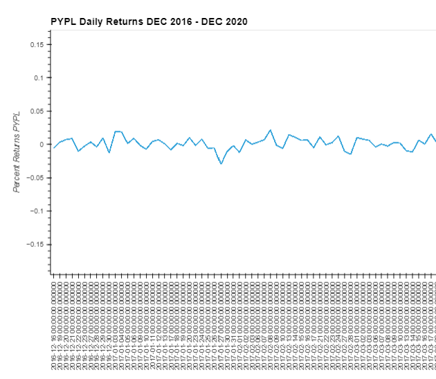

# ETF Portfolio Analyzer

This Jupyter Notebook will read data from a database filled with pricing information on ETF holdings: GDOT, GS, PYPL and SQ. Utilizing Pandas, HoloViews and SQL Alchemy interactive vizualizations will be created from highly selected database derived data. Finally, the .ipynb file will be deployed on a web browser for local access. 


---
## Technologies

Language: Python 3.9.12

Libraries used:

[Pandas](https://pandas.pydata.org/pandas-docs/stable/index.html) - For the creation and visualization of Data Frames

[Jupyter Labs](https://jupyter.org/) - An ipython kernel for interactive computing in python

[PyViz hvPlot](https://hvplot.holoviz.org/index.html) - A high level python library for interactive data visualization

[Voila](https://voila.readthedocs.io/en/stable/index.html) - A python library used for deploying web applications

[SQL Alchemy](https://docs.sqlalchemy.org/en/13/dialects/index.html) - A SQL engine utilized with python


---

## Installation Guide

If you are using an anaconda or a conda environment chances are pandas, hvplot and jupyter labs are already installed in your virtual environment. In addition, installing SQL Alchemy and Voila will be required to interact fully with this project. 

For a full install activate a conda development environment and run in GitBash if not already installed:
```python
    conda install pandas
    conda install jupyterlab
    conda install -c pyviz hvplot
```

To install the other dependencies not included in the anaconda environment run:
```python
    pip install sqlalchemy
    conda install -c conda-forge voila
```

Check the to make sure everything has been installed properly
```python
    conda list pandas
    conda list hvplot
    conda list jupyter lab
    conda list sqlalchemy
    conda list voila
```

---

## Usage

To run this jupyter lab notebook you will need to use GitBash and navigate to where you have exported the files associated with this project and activate your dev environment.
Next, this project will be activated using Voila and it will be hosted on a local server.
```python
    cd <your-file-path-here>
    
    conda activate <your-dev-environment>
    
    voila etf_analyzer.ipynb
```

This will open your default web browser and Voila will create a local server in which this notebook will be displayed. The hard code will not be viewable, however, all of the interactive tables and graphs will be shown.

Make sure to follow the markdown cells that have been displayed to follow the analysis

There are a few interactive graphs for PYPL specifically: the daily returns and the cummulative returns. Finally, there is an entire portfolio analysis where the cummulative returns are displayed for all 4 holdings in the ETF: GDOT, GS, PYPL and SQ.

---

## Highlights:

To view a bigger and higher resolution video go to **ETF_Analyzer_Web_App/ETF_Portfolio_Analyzer_View_Here.webm** in the repository files.

### Here is a video of the code being displayed:


### Here are a few of the interactive visualizations




---
## Contributors

Created by Silvano Ross while in the UW FinTech Bootcamp
> Contact Info:
> email: silvanoross3@gmail.com |
> [GitHub](https://github.com/silvanoross) |
> [LinkedIn](https://www.linkedin.com/in/silvano-ross-b6a15a93/)

---

## License

[MIT](LICENSE)


